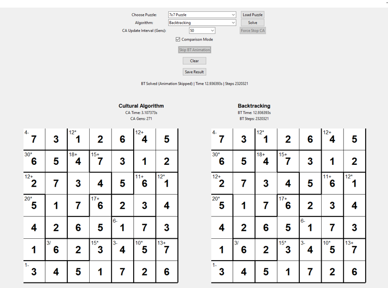

# 🧩 KenKen Solver – AI Comparative Study

## 📌 Project Overview
This project implements and compares **two AI algorithms** for solving KenKen puzzles:
1. **Cultural Algorithm** (meta-heuristic)
2. **Backtracking** (exact search)

It has a functional GUI that showcases how these two algorithms can solve kenken puzzles.

## 🎯 Features
- Interactive Tkinter GUI
- Real-time solving visualization
- Side-by-side algorithm comparison
- Supports puzzles from 4×4 to 8×8
- Save/export solutions
- Force-stop and skip animation controls

## 📸 Screenshot

## 🚀 Quick Start

### Prerequisites
- Python 3.10+

### Installation
# 1. Clone the repository
git clone https://github.com/YousefAhmeda1/KenKen-Solver-AI.git
cd KenKen-Solver-AI

# 2. Run the solver
python src/main.py
[Open the solver by running main.py]
